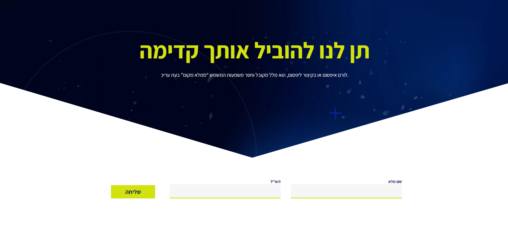

# Let Us Lead You Forward

A pixel-perfect HTML & CSS implementation of a professional services landing page Figma UI design, built with Bootstrap 5.



---

## Table of Contents

- [Overview](#overview)
- [Demo](#demo)
- [Tech Stack](#tech-stack)
- [Project Structure](#project-structure)
- [Getting Started](#getting-started)
- [Design Reference](#design-reference)
- [Bootstrap Usage](#bootstrap-usage)
- [Responsive Design](#responsive-design)
- [License](#license)

---

## Overview

This project is a UI implementation exercise built from a Figma design. It was built using Bootstrap 5 for layout and utility classes, supplemented by custom CSS for project-specific styling. The result is a responsive, well-structured landing page for a professional services brand.

---

## Demo

Open `index.html` directly in your browser — no build step or server required.

---

## Tech Stack

| Technology | Version | Purpose |
|---|---|---|
| HTML5 | — | Semantic page structure |
| CSS3 | — | Custom styles on top of Bootstrap |
| Bootstrap | 5.3.3 | Grid system, utilities, and responsive layout |

---

## Project Structure

```
let-us-lead-you-forward/
├── index.html                      # Main HTML file (Bootstrap CDN linked)
├── let_us_lead_you_forward.css     # Custom overrides and additional styles
└── images/
    ├── project_preview.png
    ├── envelope.png
    └── 2x_envelope.png             # Retina-ready version
```

---

## Getting Started

1. Clone or download the repository.
2. Open `index.html` in any modern browser.

Bootstrap is loaded via CDN — no local installation required. An internet connection is needed to load Bootstrap styles and scripts.

---

## Design Reference

This project was implemented based on a Figma design. Key design elements include:

- Centered content layout using Bootstrap's grid and flex utilities
- Retina-ready images (`2x` variants included)
- Contact/CTA section with envelope icon
- Custom CSS layered on top of Bootstrap defaults

---

## Bootstrap Usage

This project uses Bootstrap 5.3.3 via CDN. Key utility classes used include:

- `container-lg`, `w-50` — responsive container sizing
- `d-flex`, `flex-column`, `align-items-center`, `justify-content-center` — flexbox layout
- `mt-3` — margin spacing utilities

Custom styles in `let_us_lead_you_forward.css` override and extend Bootstrap where the design requires it.

---

## Responsive Design

Bootstrap's grid and utility classes provide baseline responsiveness. Custom media queries in the CSS file handle any design-specific breakpoint adjustments.

---

## License

This project is intended for educational and portfolio purposes.
